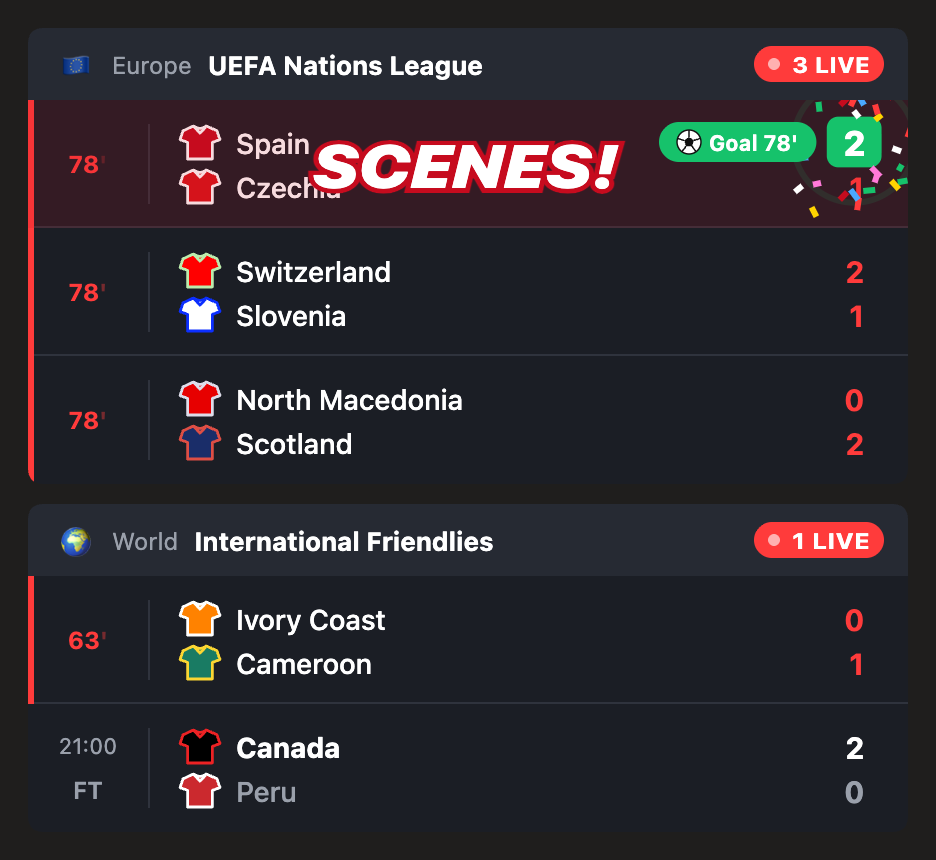
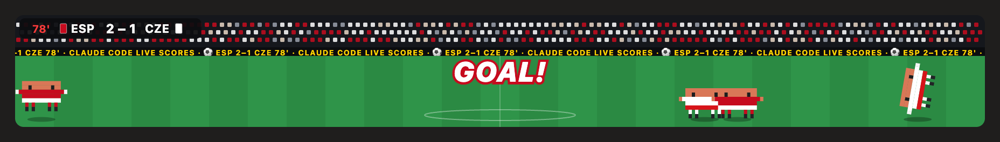
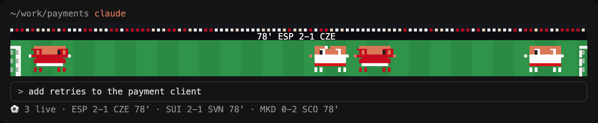

# ⚽ Claude Live Scores

**Live football inside Claude Code.** Scores from the top 5 European leagues and the big national-team competitions in a dark scores pane, a celebration for every goal, and Claude mascots in the live match's kits playing a kickabout above your prompt.

A free, open-source mod for Claude Code.

[](docs/promo.mp4)

<sub>15 seconds, made from the mod's own renderers and the real matches of launch night. [Watch with sound (MP4)](docs/promo.mp4).</sub>

**Quick start:** paste this into Claude Code and let it do the rest:

```
Install the Claude Live Scores mod from github.com/thickiran/claude-live-scores
```

Or install it yourself in two commands ([below](#install)).



<sub>The pane on launch night: real Nations League and friendly fixtures, with Spain's goal celebration caught mid-flight.</sub>

## What you get

| | |
| --- | --- |
| **A scores pane** | Today's matches grouped by competition: the live minute (red, ticking), a kit badge in each team's colours, red cards, half-time and full-time results. `All` and `Live` filters. |
| **Goal celebrations** | The ball arcs into the score, the score pops, confetti bursts, a "GOLAZO!" sweeps across the card and a chip names the scorer. Plus a toast, wherever you are. |
| **Red cards and VAR** | A red card flips in. When VAR takes a goal back, a shaking "VAR · NO GOAL" says so. |
| **The mascot pitch** | Above your prompt, two keepers and two outfielders in the live match's kits play on: dribbles, tackles, saves, a shot off the crossbar. When the real match scores, so do they, with the net bulging, the keeper beaten and the crowd going up. |
| **A status line** | `⚽ 3 live · ESP 2-1 CZE 78' · SUI 2-1 SVN 78'` |
| **Kick-off and full-time** | A toast when a match starts or ends; the pane opens on its own when a match kicks off. |

**Competitions:** Premier League, LaLiga, Serie A, Bundesliga, Ligue 1, FIFA World Cup, EURO, Copa América, Africa Cup of Nations, UEFA Nations League, World Cup qualifiers (all confederations), EURO qualifiers and international friendlies.



<sub>The mascots wear the real teams' colours. When the shirts clash, the away side changes into its second kit.</sub>



<sub>In the terminal, the same match in coloured block pixels, with the score as text.</sub>

## Install

In Claude Code:

```
/plugin marketplace add thickiran/claude-live-scores
/plugin install live-scores@claude-live-scores
```

Then start a new session. `/scores` opens the pane; while a match is live, the pitch plays above your prompt.

> **Requires a Claude Code build with plugin function hooks (mods).** The API is early access and may change between releases. If `/scores` doesn't exist after installing, your build may not have it yet.

## Commands

| Command | |
| --- | --- |
| `/scores` | Open the scores pane |
| `/scores live` · `/scores all` | Show only live matches, or all of today's |
| `/scores refresh` | Fetch the scores now |
| `/scores pitch` | Turn the mascot pitch on or off (`pitch on`, `pitch off`); remembered between sessions |
| `/scores demo` | A scripted demo match: a goal, a red card, a VAR decision and full time, in about a minute |
| `/scores close` | Close the pane |

## Where the scores come from

From ESPN's public scoreboard feed, the JSON behind ESPN's own scoreboards. No account or API key is needed. It is undocumented, so it can lag the broadcast a little or change without notice.

The mod checks every 30 seconds while a match is live or about to kick off, and every 10 minutes otherwise.

## Privacy

The mod never sees your work. It hooks no tool calls, prompts, files or model responses; it only requests public scoreboards, runs no programs and sends nothing about you. [The plugin's README](plugins/live-scores/README.md) lists every hook, program and host exactly.

## Developing

Agents (and humans): start with [AGENTS.md](AGENTS.md).

```bash
npm test          # validates the marketplace and the plugin, and runs its engine tests
npm run preview   # writes preview.html: today's real scores and the pitch, drawn as the desktop app draws them
```

The mod is `plugins/live-scores/`:

- `hooks/register.tsx`: every hook and every call to Claude Code (`$`): polling, goal detection, the pane, the pitch band, `/scores`
- `hooks/espn.ts`: the competitions and the scoreboard parser
- `hooks/svg.ts`: the scores cards and their goal, red-card and VAR animations
- `hooks/pitch.ts`: the mascot kickabout: choreography, the desktop's animated SVG, the terminal's block pixels
- `tests/pane.test.tsx`: draws the pane and the pitch on the terminal and desktop surfaces

Load a local copy with `claude --plugin-dir plugins/live-scores`.

Ideas and pull requests welcome: more competitions, new celebrations, set pieces for the mascots.

## Notes

An unofficial fan project. It is not affiliated with or endorsed by Anthropic, ESPN, or any league, federation or club. Team names and colours belong to their owners and are shown only as data.

## License

[MIT](LICENSE)
